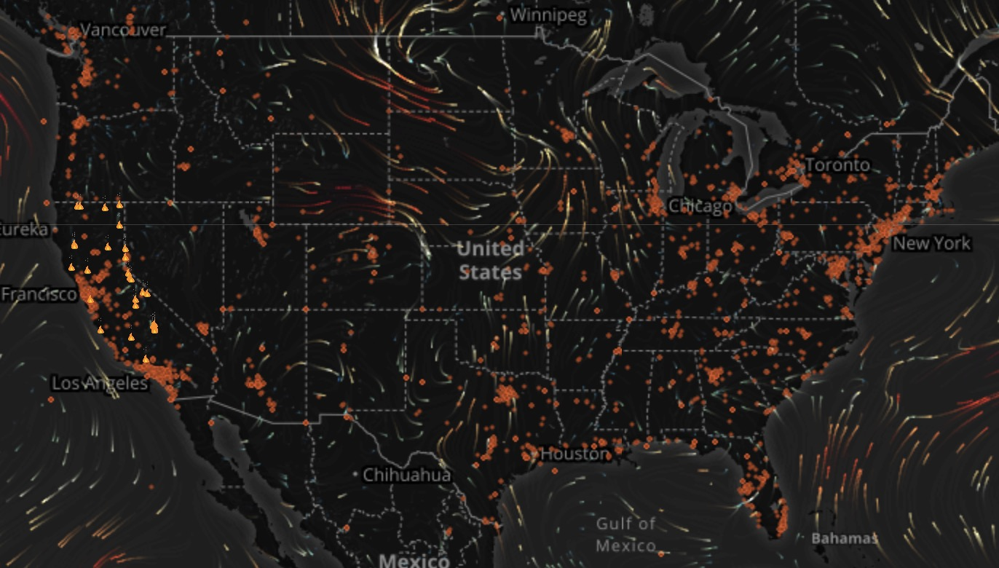

# Wildfires

[Wildfires](http://wildfires.ics.uci.edu:2333):fire: is an innovative and well-designed platform implemented by [these contributors](https://github.com/Yicong-Huang/Wildfires/graphs/contributors).

# About

**Wildfires** applies machine learning approach to detecting wildfire events based on social media and environmental data. 
It also plays as a great visualization platform for wildfires with environmental variables as well as social media information.

# More information

