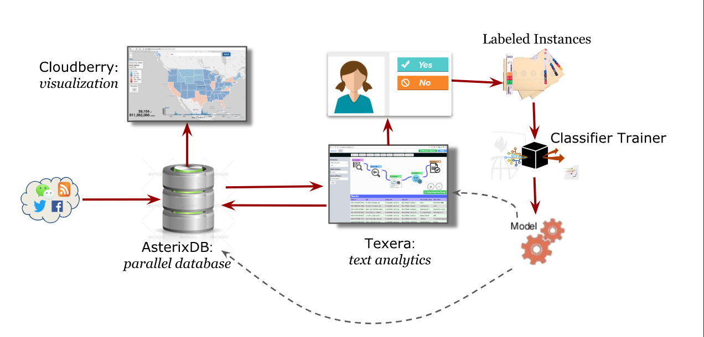

# Wildfires   
[Wildfires](http://wildfires.ics.uci.edu):fire: is an innovative and well-designed platform that realizes analytics and visualization of wildfires by using social media data. 

[![Contributors][contributors-shield]][contributors-url]
[![Forks][forks-shield]][forks-url]
[![Issues][issues-shield]][issues-url]

## Table of Contents

* [About](#about)
* [Developer Start Guidance](#developer-start-guidance)
* [Documentation](#documentation)

## About
**Wildfires**    applies machine learning approach to detecting wildfire events based on social media and environmental data. 
It also plays as a great visualization platform for wildfires with environmental variables as well as social media information, e.g. tweets from Twitter.

##### Project goals:
* Detecting wildfires early using social media
* Analytics of wildfires using social media data
* Visualization of social media and environment data

## Developer Start Guidance
Please follow the [Developer Start Guidance](https://github.com/ISG-ICS/Wildfires/wiki/Developer-Start-Guidance) to contribute to Wildfires.

## Documentation
* [Fronend Layer Usage](https://github.com/ISG-ICS/Wildfires/wiki/Frontend-Layers-Usage)
* [Task Manager Usage](https://github.com/ISG-ICS/Wildfires/wiki/Usage-Of-Task-Manager)
* [Text Classification using CNN](https://github.com/ISG-ICS/Wildfires/wiki/Text-Classification-using-CNN)
* [AllenNLP Event2mind Classification](https://github.com/ISG-ICS/Wildfires/wiki/AllenNLP-Event2mind-Classification)
* [Image Classification using VGG and ResNet50](https://github.com/ISG-ICS/Wildfires/wiki/Image-Classification-using-VGG-and-ResNet50)
* [ResNet50 In Image Classification](https://github.com/ISG-ICS/Wildfires/wiki/ResNet50-In-Image-Classification)
* [Time Series Component](https://github.com/ISG-ICS/Wildfires/wiki/Time-series-component)
* [Task-Manager's-task-implementation](https://github.com/ISG-ICS/Wildfires/wiki/Task-Manager's-task-implementation)
  

[contributors-shield]: https://img.shields.io/github/contributors/ISG-ICS/Wildfires.svg?style=flat-square
[contributors-url]:https://github.com/ISG-ICS/Wildfires/graphs/contributors
[forks-shield]: https://img.shields.io/github/forks/ISG-ICS/Wildfires.svg?style=flat-square
[forks-url]: https://github.com/ISG-ICS/Wildfires/network/members
[issues-shield]: https://img.shields.io/github/issues/ISG-ICS/Wildfires.svg?style=flat-square
[issues-url]: https://github.com/ISG-ICS/Wildfires/issues

